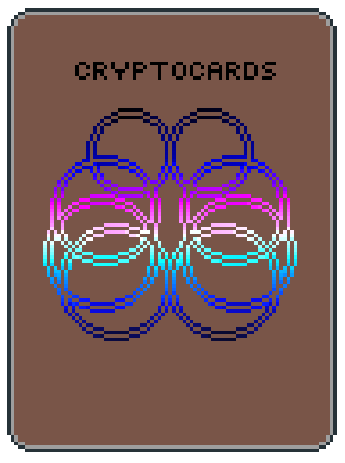

As one of the final projects for my degree at Temple University, 5 friends and I 
endeavored to build a card game whose collectible "cards" were really tokens
on an Ethereum blockchain. Check out the source 
[here.](https://github.com/nickk752/CryptoCards) In this post I'll try to 
break down mistakes we made, what we did right, and things that I learned 
along the way. 

    <cite> The cardback art used in-game </cite>

### Initial Goals and Adjustments
When we first set out, learning from previous projects where we were over-ambitious,
we had some moderately lofty but not too extreme goals for this website, that
from a high level looked like this:
- Users can buy and sell cards on the site via auctions on the blockchain
- Users can combine cards to create new ones
- Users can build decks with their cards, and battle via a browser-based game
- Game logic on the blockchain to prevent cheating

I'm happy to say we did eventually provide most of that functionality, though
at the expense of much visual polish. The only goal we had to drop entirely 
was putting game logic on the blockchain, as research quickly showed it would 
require people to spend an unreasonable amount of ether on playing a game, so 
we marked it as unfeasible. 

Some other smaller features also had to be dropped. We wanted to store the art
for the cards on the blockchain as well, but it also appeared unfeasible.
I was supposed to develop a ranked matchmaking system for players, but had to
go for random matches instead, unfortunately not because it wasn't feasible but
because I was running out of time, for reasons you'll find below.

### Mistakes
> By failing to prepare, you are preparing to fail
>
>  <cite> Benjamin Franklin </cite>

There are two big mistakes I want to talk about here, one pertinent to the 
whole team, and one more on me personally. Both revolve around preparation. 

As a team, we didn't invest enough effort in planning our project, both through user
stories and more general architecture, such as block, sequence, or module diagrams.
While we were required to create all that documentation and stories and post them to
the management system the class was using, we sometimes just phoned it in - not 
really going into the amount of detail we should have. 

That this was a major problem became apparent 
later on in the development process, when we encountered parts of the system
that didn't work together as they should have even when implemented correctly,
or that left functionality gaps, forcing us to shove what we needed where it 
would fit, never a good strategy when dealing with this many moving parts.  

It was shocking how much smoother things were moving on the modules with proper design,
just pick up a task, implement the required small bit of functionality, run
the tests, rinse, and repeat until you logged your hours for the day. In contrast,
when things were ambiguous, even a task that should have been run of the mill could
require you to talk to 2 or 3 different team members about how something should be
done, and if you weren't very familiar with the rest of the components it was to interact with, 
you may leave your implementation lacking some functionality that wasn't specified. 
Once a couple such modules have been added, if not properly
documented, they could snowball into complicating even well planned parts of the system.

While we all participated in the design and, to an extent, the implementation of the 
entire project, early on we split into three two-person teams, one focused on the 
smart contracts, one on the main website, and one on the game. I was on the game team.

The more personal mistake I want to talk about involves a lack of preparation with regards
to developing multiplayer browser games. While I did some small demos and tutorials to
get a feel for the tools involved ([phaser](https://phaser.io/) and 
[socket.io](https://socket.io/) mostly) I didn't do much research into the common 
patterns and best practices used in the design of such programs.

This meant when I initially designed
the structure of the games objects and interactions, not only were my modules not as 
efficient and self-contained as they easily could have been - I also alienated myself
from a good portion of the resources available to me. No one online can help me 
understand why my janky resource system sometimes doesn't update when it should, when
none of my events to trigger such an update are patterns used by others. If I had followed
through with the tutorials I started instead of just stopping when I knew I could get 
the functionality I wanted, I would be able to continue to draw on them. 

Another related problem was that this was my first real exposure to anything more than 
trivial javascript. So while I did spend a good deal of time researching and learning 
throughout the project, a lot of that was focused on learning the in's and out's of
JS, and ES6 in particular. I did come out of it with a much more positive view of JS 
than I had before though. I used to think of it as kind of a joke, knowing it mostly for
it's meme-y quirks surrounding type coercion. 

This lack of javascript knowledge lead to some terrible initial designs based using 
prototypical inheritance, and an eventual switch to ES6 - which I should've just used
from the beginning. 

A more minor (technically speaking) issue with the whole project was that the card game
we designed was by no means balanced, or even really that fun. But as none of us really
studied any game design in that sense, and it didn't impact the ability of the game to 
be played, I don't view it as that big of a problem. People still play monopoly, even
when vastly superior board games are available!
### What Went Well

As mentioned above, we did manage to pull off most of the functionality. Using a chrome
plugin to connect to their wallet, users could purchase cards for Ether on the site, and 
then create an auction to sell them
if they wanted, or put them into a deck, and (if they were
lucky) load that deck into the game to play with. While not entirely bug-free, and 
certainly not as pretty as we'd hoped, everything did work correctly for the final demo. 
(though due to the planning mistakes outlined above, not much earlier than that)

While the site's interaction with the smart contracts and the game were tricky and took 
many more redesigns and ad hoc adjustments than anyone sensible would admit to,
the actual site itself was mostly smooth sailing, based on a [MERN](http://mern.io/) stack
(MongoDB, Express, React, and Node) it had an account system, an inventory management page,
and an auction house, as well pages for describing the game and how the cards worked.

Thanks to a lot of similar work on non-fungible token systems on the blockchain, see 
[CryptoKitties,](https://www.cryptokitties.co/) the blockchain work went fairly well, at least
as far I know, only being at best semi-involved in that part of the project.

Something I'm proud of is the zone system I made for the game-board, that allowed easy drag and 
dropping of cards from hands to the battlefield, as well as summary state updates to be sent 
between players as they took actions. It was incredibly satisfying the first time I played a card as player
1 and saw the card appear in the appropriate spot for player 2. Phaser was a lot of fun to work with, and is fairly 
well documented. 

Another good part was the art for the game, sometimes we would take breaks during long frustrating
nights coding in a CS lounge on campus and just make pixel art for the cards. While none of it was
awe-inspiring, it was a lot of fun to make, and we even made a card poking (light-hearted) fun at our professor.

### Big Lessons
Overall, I think there are three big takeaways from my experience with this project.
- More work in the design stage means less frustration in the implementation stage
- Best practices and common patterns are widely used for a reason, and to be ignorant of
them risks cutting yourself off from potential resources
- Build familiarity with tools on small projects before you attempt to design large projects
to be built with them

