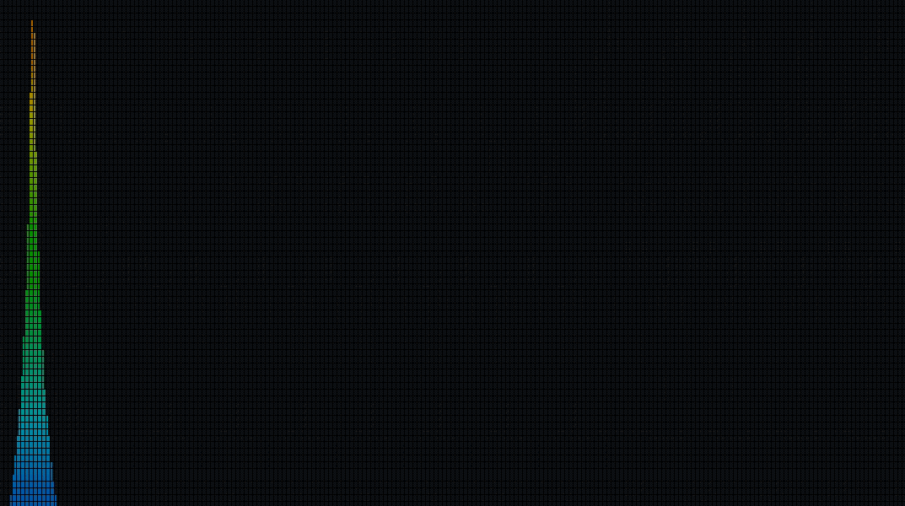
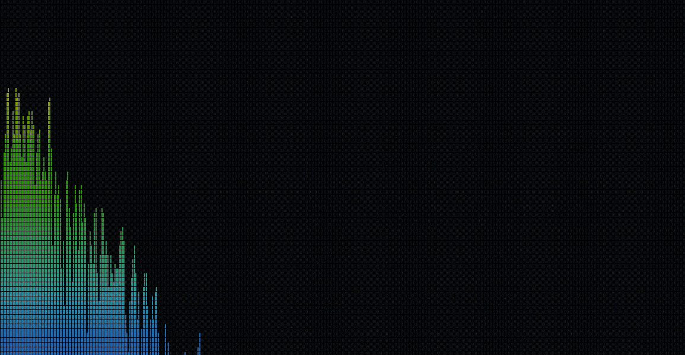

One of my favorite projects, my friend Quentin and I spent a few weeks
during the first half of our junior year building an audio frequency visualizer. While it ended up
being on the smaller side codebase wise, it took a lot of research and 
many revisions to come to fruition. Check out the [source](https://github.com/TimtheStew/AudioSpectrumVisualizer)

Since both Quentin and I have a deep love of music, and I've been fascinated
with the Fast Fourier Transform and it's plethora of applications since my 
business school days, it seemed a natural choice to build some sort of spectrum
visualizer. The other main idea that seemed appealing was doing something with a cluster 
of Raspberry Pis, but we weren't sure what.

    <cite> Sine tones, increasing in frequency(Hz) and decreasing in decibels(DBFS) </cite>

### Initial Goals
This was one of the first times, aside from hackathons or personal projects,
where we as students were given the go ahead to create or choose our own 
projects. And so, like the naive young fools we were, we set ourselves some
very ambitious goals. Also, as we were still really keen on that Raspberry Pi 
idea, we managed to shove them in somewhere too. We wanted to build rhythm game with:
- Multiple color-schemes and display modes
    - tap keys or click moving objects in time with music, etc.
- Using [OpenGL 4](https://www.khronos.org/registry/OpenGL-Refpages/gl4/) to display 3D graphics.
- Using MIT's [fftw](http://www.fftw.org/) to perform the analysis.
- At the insistence of our professor, we were to do the FFT in real-time.
- All of this was to happen on a Raspberry Pi, and be controlled wirelessly. (so you could
plug it into a TV and play from your couch)

### The Big Mistake: Adjusting Goals for the Real-World 
Unfortunately, we soon found out that not only were most of those goals unfeasible in
the few scant weeks we had (we were also both busy with other classes) they were also way 
over our heads technically. 

After about a week of bashing our heads against the wall that is OpenGl 4's programmable pipeline,
we decided to instead used the fixed-function pipeline of OpenGL 2, and to do 2D graphics with it, as
it seemed much more conquerable.  

Neither of us had ever
developed a game at all, let alone in something as low level as OpenGL, so the interactive
component went by the wayside as well. 

As relative newbies to the FFT signal processing scene, we opted
for the more beginner friendly FFT module from [NumPy](https://docs.scipy.org/doc/numpy/reference/routines.fft.html). 
Finally, as the rapberry pi's we ordered weren't set to arrive until shortly 
before it was due (too cheap to pay for express shipping) we dropped that as well. Though the
ubuntu version of the project probably wouldn't be that hard to port over to a Pi.

While it felt bad at the time to cut down our dreams for the project so much, it was worth it at 
the end to produce a working program. It was also a big learning experience, if we had set more 
reasonable goals from the get go, we could have polished our project up a lot more at the end.

For example, as you may notice, the gifs on this page dont look quite like a spectrum display you'd
see on a stereo system or from a music player. That's because we display the frequency spectrum
linearly, instead of logarithmically. So the first 20% of the vertical bins should really take up most
of the screen. We also never got around to labelling the axis with the Decibels or Frequencies. If we hadn't 
wasted all that time starting to learn tools we didn't end up using, we could have easily added
those features, as well as multiple color schemes. 

### The Good Part
While this project was beset with many downgrades, there were some nice moments along the way.

    <cite> A couple seconds of Mozart's Symphony No.35 in D major IV - Finale Presto </cite>

While it could certainly be improved, our primitive syncing method works quite well. It turns out
the issue of syncing audio to graphics - or rather of keeping them synced once playback has begun, can be
very tricky, especially with audio longer than your average video game sound-effect. Evidence for this abounds in even 
modern games, where slowdown often causes dialogue de-sync. 

Our GUI create two processes,
one for openGL to display the graphics, and another python one for the analysis. The stdout of the analysis
process is piped into the stdin for the input, then they both exec their respective programs, and playback 
begins. 

I also learned a lot of how FFT's like this need to be done, and the various pre-processing methods 
you have to employ to get accurate data. You have to deal with multiple channels, filtering, and perhaps
most frustrating, windowing - because unless you generate your own sine tones, music is never going to
be periodic in a 1024 sample window. While conceptually windowing isn't too hard to understand, adjusting 
for it post-FFT was touch and go for a while there.

In particular I remember the moment I finally got the FFT program to output the correct decibels.
After a couple days of tweaking parameters and multipliers, finagling the high-pass filtering, and reading many,
many, guides on fourier audio analysis (all of which seemed to have a piece of what we needed, but not all) 
when my sine tone wav files actually gave me the output I was hoping for, I actually did a little
dance in celebration. 

### Wrap-up
Even though we didn't meet most of our initial goals, I still consider this project a success. I learned a lot,
both personally and technically. Afterwards I felt much better equipped to tackle the projects I wanted - I felt 
I could more realistically gauge the amount I'd be able to accomplish, or least learn how to gauge it by surveying
the landscape I desire to enter. I also picked up technical skills, in the basics of digital signal processing,
fourier analysis, and OpenGL. Not to mention I sharpened my python teeth, having mainly used it in the past for 
things like [Project Euler](https://projecteuler.net/) or [DailyProgrammer](https://www.reddit.com/r/dailyprogrammer/).

The biggest lesson I learned is to be more realistic about what I can achieve, which will spare
me a lot of heartache, and also let me go the farthest I can in the time I have.

