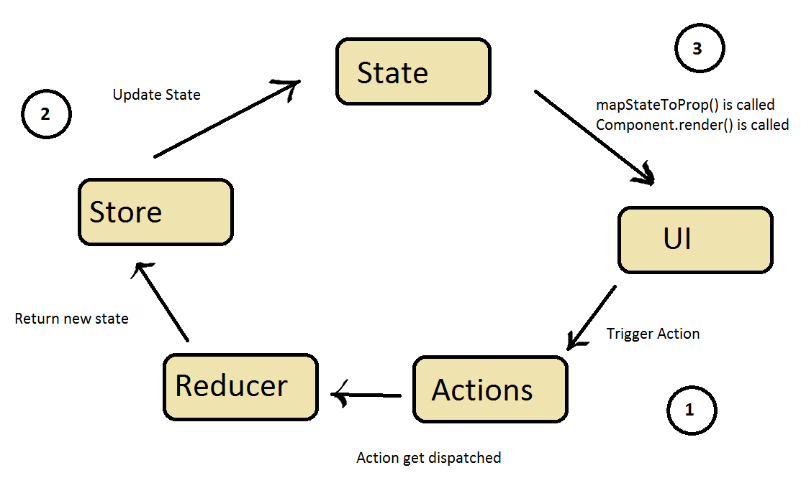

For about the past month, my friend Atta and I have been working on
a new project. We've wanted to build something together for some time
but kept throwing around ideas without actually starting. So finally 
we just picked one that interested us both, and went for it.

Umbrella Chat is going to be an end-to-end encrypted chat service built
as a 12-factor web-app. [Check out the source here!](https://github.com/TimtheStew/umbrella-chat)

## The Stack

On the back-end, we're using Apollo Server, for ease of setting up
a GraphQL API, and Sequelize as an ORM tool for our Postgres DB.

In the front, we're using webpack to bundle our assets, babel to maintain
compatibility, React to display a UI, and Redux to manage our state.

That all sounds great! Modern and buzzword-y! But what does it mean?

Well strap in, and let me tell you...

### Back-End

[GraphQL](https://graphql.org/) is an alternative to traditional RESTful
API's, developed at facebook. The basic idea behind it is that instead of
having lots of endpoints for very specific queries, you have one
"smart" endpoint, that delivers just the data the client needs, and in whatever
configuration they need it. This cuts down on data processing on the front end, and 
means you don't have to write a new query every time your front-end needs a
different collection of data.

A GraphQL server is a layer that sits between your front end and your data store(s).
It works with three main components: Schemas, Queries, and Resolvers.

GraphQL's typed **schemas** and [Schema Definition Language](https://www.apollographql.com/docs/apollo-server/essentials/schema#sdl)
are at the core of how it functions. A schema is how you describe your data and 
it's types to graphql. SDL offers several scalar types (bools, ints, strings, etc.)
and some abstractions, like objects, to allow you to define your data in terms
of types and relationships. For instance a rudimentary Chat definition might 
look like:
```javascript
type Chat{
    id: ID
    name: String
    users: [String]
    createdAt: String
    updatedAt: String
}
```
There are other things you'll probably want to include in schemas, such as extensions
to the Query and Mutation types, but I won't get into those here. 

**Queries** are how you ask for the data you want, and are store-agnostic! It doesn't 
matter where what you need comes from, GraphQL takes care of that for you. They can
also take arguments, which plays into that "only the data you need" idea.
So lets say I wanted a chat with a particular id, my query might look like this:
```javascript
query{
    chat(id: "someUUID"){
        name
        users
        updatedAt
        createdAt
    }
}
```
Since both queries and schemas don't care about where things come from, you figure 
something has to right? Thats where **resolvers** come in! A resolver does what 
it says on the tin - it resolves abstract queries into concrete data by following
the procedures you lay out for it. More simply, it tells GraphQL where and how to look
for what it wants.

GraphQL is really just a specification, and can be implemented in any language. For this
project the implementation we're using is
[Apollo Server](https://www.apollographql.com/docs/apollo-server/) which allows for 
easy set-up and auto-documenting of the API your GraphQL server uses. It also 
offers compatibility with a wide range of sources
(such as a Postgres DB) and is popular, well-documented and well-maintained. 

For our database, we're using [PostgreSQL](https://www.postgresql.org/), which
is an open source object-relational database system. It has an emphasis on
extensibility and standards compliance, as well as a wide support base, given
it is the DB of choice for many individuals and organizations. 

For ease of querying our database, we're using an ORM, or Object Relational Mapping 
(library) called [Sequelize](http://docs.sequelizejs.com/). Sequelize is a
promise based Javascript ORM, that supports a handful of popular DBs such 
as MySQL, Microsoft SQL Server, **Postgres**, and SQLite. It's purpose is to hide the 
mechanics of SQL querying behind an object model. So instead of 
writing a statement like 
```sql
SELECT * FROM chats WHERE name = 'My Squad' 
```
you would do:
```javascript
Chat.findAll({
  where: {
    name : 'My Squad'
  }
});
```
Now, with such a trivial example, it might seem we've actually made things 
more complicated, but as queries grow in demand or generality, they can become quite tricky to write
optimally, and that is where Sequelize really shines. It means that I don't 
have to be a SQL master to use fast queries, and the object model can greatly
simplify other more ungainly selections. However, since Sequelize isn't familiar 
with the ins and outs of my data, I can't expect it be as good as an actual SQL master 
at writing queries, but I can expect it to be better than me.

This object model is how our GraphQL resolvers will return the data they need to.

Using an ORM allows us to employ some OOP techniques to better manage and define our data,
even at the database level. Also, because it abstracts the DB, we could switch to any other DB supported by 
Sequelize down the line without too much hassle. 

### Front-End

The front of our front-end is [React](https://reactjs.org/). React is a two-part
framework for creating UI's in a browser or "browser-like" environment. One part
is React itself, which uses components, and their associated objects like props, to
describe at once both the visual and functional aspects of a UI. The other part is [React-DOM,](https://reactjs.org/docs/react-dom.html)
which is a virtual [DOM](https://developer.mozilla.org/en-US/docs/Web/API/Document_Object_Model/Introduction)that allows for faster loading and changing of the page through optimized DOM management.

If you're familiar with android development, React components are very similar to activities and fragments, in that they're modular pieces which represent screens or sections of screens. For example, 
you might have a page level component for a login page, which contains several other
components such as a header, footer, loginModal, etc. It may also contain other non-visual components, 
which just perform some background logic, 
these are more akin to an android service. And since all these components are modular, you can reuse them, 
so all of your page level components (often called containers, or views, or something similar) can use the 
same header and footer components. 

Again, similar to android, these components will usually be subclasses of the main React.Component class, and follow a lifecycle, with callbacks corresponding to
various points in that lifecycle, such as when they are about to mount, or just have mounted. 

One of the core ideas of React is the marriage of display logic and functionality. To this end,
React uses something called [JSX](https://reactjs.org/docs/introducing-jsx.html) which
is an extension for Javascript that allows for the direct embedding of markup syntax into Javascript.
Jsx is how components are defined.

While React has built-in functionality for managing the state of each component in your application,
it can get head-scratchingly complicated as your application grows. Some component updates
your data, which updates a couple other components, which updates your data, which updates other components...

To reduce this headache, we use a state container called [Redux](https://redux.js.org/). So that
instead of having to micro-manage the state of our application at a per-component level, we
can do it all in one place - the redux store. 

The store contains the state of our entire application, usually in something like a map, which it doles 
out as props to our various components. Whenever our components trigger an Action, redux reduces that
action to changes in the store, which will cause our components to update with new props. 



Our front-end is connected to the backend using [Apollo Client](https://www.apollographql.com/docs/react/).
It has some very convienent features, 
especially when used with React. It lets us create Query Components, which
encapsulates a lot of data-fetching tasks nicely into a pattern that fits well 
with React and Redux. It also ships with an intelligent cache.

On the back-end of the front end, we use some pre-processing to turn all our code into
a website. We have a couple smaller pre-processerers like one for SASS, which lets us write
more robust CSS. A major pre-processor is [babel](https://babeljs.io/) which is really
a transpiler. It lets us write modern ES6 javascript, which is not yet fully supported
by all browsers, by converting it into ES5 javascript that is. For example it would turn
this code, utilizing lambda functions:
```javascript
var odds = evens.map(v => v + 1); 
var nums = evens.map((v, i) => v + i);
```
into this, which doesn't:
```javascript
var odds = evens.map(function (v) {
    return v + 1;
});
var nums = evens.map(function (v, i) {
    return v + i;
});
```
All of this preprocessing, and more (such as minification), is handled by [WebPack](https://webpack.js.org/).

WebPack, along with providing all the task-running functionality described above (applying
those processors in a specified order), also builds a dependency graph of our all our
static and non-static assets, from CSS to images. I'm not going to go too deep into it here,
there are plenty of great resources describing the webpack process all over the web. 

The long
and the short of it is that webpack allows us require() in the browser. This means instead 
of having to hand order concatened javascript files, and **rely on global variables** we can make use of the modulization
provided by require(). Webpack will assemble all our javascript into
the minimal amount of files, and, with the help of an HTML plugin, directly insert those
scripts in the right order into a template HTML file. It will take all these files,
modified to properly include the static assets, and put them into a directory for
distribution. Boom, website!

### The End
I hope you've enjoyed the read. Stay tuned for the next post where I'll go over
what it means for this app to be 12 factor!


